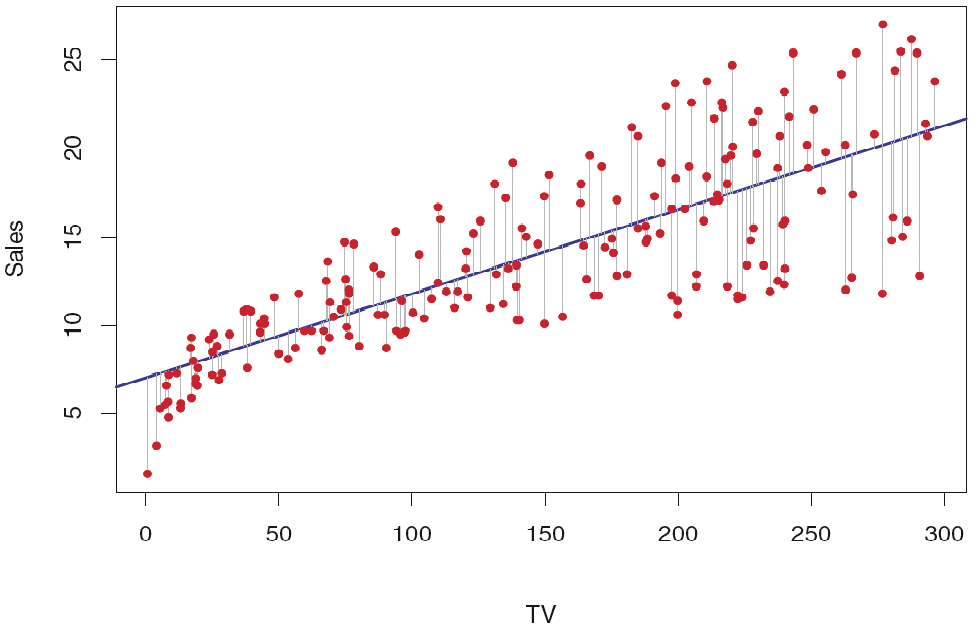

```{r setup, include=FALSE}
knitr::opts_chunk$set(echo = TRUE)
library(broom)
library(data.table)
library(dplyr)
library(caret)
library(sjPlot)
library(randomForest)
library(pls)
library(car)
library(knitr)
library(glmnet)
library(ggplot2)
library(GGally)
library(leaps)

source("functions/BestModelReg.R")
source("functions/table.R")
setwd("C:/Users/Kenia.Way/OneDrive - IHS Markit/Documents/lnch-learn")
```
***
<!-- <div class = "document"> -->

# Dataset
Here we have a dataset with advertising information. It displays `sales` (in thousands of units) for a product, as a function of `advertising budgets` (in thousands of dollars) for TV, radio, and newspaper media.

Suppose that in our role as analysts we are asked to suggest, based on this data, a **marketing plan** to increase sales. What information would be useful to provide such a recommendation?

First, let's explore the data...

## Descriptive Stats

It's useful to perform basic descriptive stats to explore the data set of interest before making any hypothesis. 
<center>
```{r, echo=FALSE, warning=FALSE, comment=NA}
sales_df <- fread('Advertising.csv', stringsAsFactors = F)
summary(sales_df)
```

</center>
```{r, echo=FALSE, fig.align='center', fig.height=3, fig.cap=" Histogram and boxplot for sales."}
q1 <- sales_df$sales %>% quantile(0.25)
q3 <- sales_df$sales %>% quantile(0.75)
sales_df[, sales_level := ifelse(sales < q1, "low",   ifelse(sales < q3,  "avg", "high"))]
sales_df[, sales_level := factor(sales_level, levels = c("low", "avg", "high"))]
p_base <- sales_df %>% ggplot(aes(sales, fill= sales_level))
hist <- p_base +  geom_histogram(bins=50, alpha=.6, show.legend = F) 
box <- p_base +  geom_boxplot(aes(sales_level, sales))
gridExtra::grid.arrange(hist, box, nrow= 1)
```
**What do we want to do?**

## Marketing Plan

A marketing plan to increase sales! Maybe this includes answering the following:

1. Should we spend any money in advertising?
2. Given a certain advertising budget, can we predict sales?
3. Should we spend the same amount of money in each media?
4. How accurately can we predict future sales?
5. Is there synergy among the advertising media?

It turns out that linear regression can be used to answer each of these questions!

***
# Simple Linear Regression
The first thing to remember, is that a linear regression assumes that there exists a `linear relationship` between the response variable and the explanatory variable. This means that you can fit a line between the two. 

```{r, echo=FALSE, fig.align='center'}
p <- sales_df %>% ggplot(aes(x=TV, y=sales)) + geom_point()
p + geom_smooth(method="lm", se = FALSE)
```

This is a very simple approach to predicting a quantitative response (in our case **sales**) in terms of a single predictor variable (**TV** perhaps). In this case, the mathematical representation of this model would be: 
$$sales = \beta_{0}+\beta_{1}*TV$$

$\beta{0}$ and $\beta{1}$ are the intercept and a slope of the line describing this relationship. They are known as the model `coefficients`. Once we estimate these, we can predict future based on a particular value of TV advertising.

## Estimating coefficients and residuals
This is equivalent to finding an intercept $\beta{0}$ and a slope $\beta{1}$ such that the resulting line is as close as possible to the data points.

There are many ways of measuring **closeness**. However, the most common approach is the `least squares` criterion. This is in essence, minimizing the differences between the real values and the values  predicted by the line in our model. 

<center> </center>

In this image, we see how each grey line segment represents an error (`residual`), and the fit makes a compromise by averaging their squares.

## Hypothesis
Standard errors can also be used to perform hypothesis tests on the coefficients. In a `lm` we test the *null test hypothesis* of 
`H0`: There is no relationship between X and Y.

To test the null hypothesis, we need to determine whether our estimate for $\beta{1}$, is sufficiently far from zero (significant). In practice, we compute a t-statistic, which measures the number of standard deviations that $\beta{1}$ is away from 0. Then, we estimate the probability of a given t, assuming $\beta{1}$ = 0. We call this probability the `P-value`.

If P-value is small, we can infer that there is an association between the predictor and the response (reject null hypothesis). Typical p-value cutoffs for rejecting the null hypothesis are 5 or 1%.

```{r, echo= FALSE, results='asis'}
lm_sales_tv <- lm(sales ~ TV, data= sales_df)
lm_sales_tv_sum <- lm_sales_tv %>% summary() 
PrettyTable(lm_sales_tv_sum$coefficients, "Coefficients for lm sales vs TV")
```

Notice that the coefficients are very large relative to their standard errors, so the t-statistics are also large; the probabilities of seeing such values if H0 is true are virtually zero.

The formula describing this model is 
$$sales = 7.03+0.05*TV + Error$$

`Error` in the formula represents the deviation of the estimated values vs the true response.

Using a ***simple linear model*** we can infer that an increase of $1,000 in the TV advertising budget is associated with an increase in sales by around 50 units

## Model fit
Once we detected there is a relationship between TV and sales, we might want to quantify the extent of these. 

The quality of a `lm` is typically assessed using: Standard Residual Error (SRE) and the $R^{2}$ statistic. 

### SRE

This is the average amount that the response will deviate from the true value. ***A measure of the lack of fit, in the same units of y.***

$$SRE = sqrt(\frac{1}{n-2}*RSS) = sqrt(\frac{1}{n-2}*\sum_{i=1}^{n}(y_{i} - y_{est})^2)$$
*sum of squares residual (SSR or RSS)*

```{r}
lm_sales_tv_sum$sigma
```
In our case, actual sales deviate from the true values by aprox. 3,260 units, on average. If we recall from our previous descriptive analysis, the mean of sales was 14,000 units, and so the percentage error is 3,260/14,000 = 23%.

### $R^2$ Statistics

Is the proportion of variance explained.

- Its value is between 0 and 1.
- Is independent of the scale of Y.

$$R^2 = \frac{TSS-RSS}{TSS} = 1 - \frac{RSS}{TSS}$$ 

$TSS= \sum_{i=1}^{n}(y{i} - mean)^2$

TSS measures the total variance in the response Y. In contrast, RSS measures the amount of variability that is left unexplained after performing the regression. An $R^2$ close to 1 indicates that a large proportion of the variability in the response has been explained by the regression.


```{r}
lm_sales_tv_sum$r.squared
```

The $R^2$ for our sales lm was `0.61`, and so just under two-thirds of the variability in sales is explained by a linear regression on TV.

Do all three media (TV, radio, and newspaper) contribute to sales? How to extend lm to more than 1 predictor?

***
# Correlation (r)

This is also a measure of the linear relationship between X and Y. The degree of association is measured by a correlation coefficient. 

* The correlation coefficient is measured on a scale that varies from + 1 through 0 to - 1.
* When one variable increases as the other increases the correlation is positive. 
  + when one decreases as the other increases it is negative.
* For a simple linear regression setting, $R^2 = r^2$

We could use a correlation matrix to help us understand this.

```{r, echo=FALSE, fig.align='center', fig.cap= "Correlation Matrix"}
sales_df %>% select_if(is.numeric) %>% ggcorr(label = TRUE)
```

A strong relationship is shown by either stronger colors in the matrix or with numbers greater than `0.5`.

In our case, we could highlight the following:

* TV and radio show a very strong linear relationship with the response (sales).
* Some predictors are correlated to each other (radio and newspaper).

***
# Multiple linear regression

Does it mean fitting multiple simple linear regression model for each predictor?

```{r, warning=FALSE, echo= FALSE, results='asis'}
# Sales on radio
lm_sales_radio <- lm(sales ~ radio, data= sales_df)
lm_sales_radio_sum <- lm_sales_radio %>% summary()
PrettyTable(lm_sales_radio_sum$coefficients, "Linear model sales vs. radio")
```

```{r, warning=FALSE, echo= FALSE, results='asis'}
# Sales on newspaper
lm_sales_news <- lm(sales ~ newspaper, data= sales_df)
lm_sales_news_sum <- lm_sales_news %>% summary()
PrettyTable(lm_sales_news_sum$coefficients, "Linear model sales vs. newspaper")
```

A $1,000 increase in spending on radio advertising is associated with an average increase in sales by around 203 units, while the same increase in spending on newspaper advertising is associated with an average increase in sales by around 55 units.

There are several limitations for this approach:

* It is unclear how to make a single prediction of sales given levels of the three advertising media budgets, since each of the budgets is associated with a separate regression equation.
* Each of the three regression equations ignores the other two media in forming estimates for the regression coefficients.
  + Can be misleading if the media budgets are correlated, like newspaper and radio.

A better approach is to extend the simple linear regression model so that it can directly accommodate multiple predictors.

## Estimating coefficients and residuals

$$Y = \beta_{0} + \beta_{1}X1 + \beta_{2}X2 + ... + \beta_{p}Xp + Error$$

As in the case of the simple linear model, the objective here is to estimate the coefficients minimizing the sum of squared residuals.

<center>
```{r, echo= FALSE, warning=FALSE, fig.align="center"}
lm_sales <- lm(sales ~ TV+ radio + newspaper, data= sales_df)
tab_model(lm_sales, file="summary.html", digits = 6)

```
</center>

```{r, echo=FALSE, comment=NA}
s <- lm_sales %>% summary()
print("Model p-value: < 2.2e-16")

```
We interpret these results as follows: 

* For a given amount of TV and newspaper advertising, spending an additional $1,000 on radio advertising leads to an increase in sales by approximately 130 units.
* The newspaper regression coefficient estimate in the simple regression case was significantly non-zero, in contrary to the multiple regression model, which is close to zero, and the corresponding p-value is no longer significant (0.7).

<div class= "summary">
Let's go back to our initial questions for the `Marketing Plan`.

1. Should we spend any money in advertising?
  - P-value is almost 0, we can suggest that at least one of the advertising media must be related to sales.

2. Given a certain advertising budget, can we predict sales?
  - Yes, through this equation:

$$ sales = 2.938889  + 0.045765* TV  + 0.188530*radio  -0.001037*newspaper$$
3. Should we spend the same amount of money in each media?

 - The p-values for TV and radio are low, but the p-value for newspaper is not.
    + This suggests that only TV and radio are related to sales. 
<center>
  ***This is referred to as variable selection, and we'll discuss it later in further detail***
</center>

4. How accurately can we predict future sales?
  - The model that uses all three advertising media to predict sales has an $R^2$ of 0.897 and RSS = 1,457 units (10%).

* What happens if we use a model with only TV and radio, as newspaper is not significant?

</div>

## Model fit

```{r, fig.align="center", comment=NA}
lm_sales_tv_radio <- lm(sales ~ TV + radio, data= sales_df)
lm_sales_tv_radio %>% summary()
```

The value of **$R^2$ will never decrease when adding an extra predictor** to the model, and this can lead to `over-fitting`. Adjusted $R^2$ reduces the value of $R^2$ until it becomes an unbiased estimate. It only increases if it reduces the overall error of the predictions is increased by adding an additional variable.

### Residuals
Another good way to test the quality of the fit of the model is to look at the residuals. An important assumption of the lm is that the error is uncorrelated and randomly distributed.

In the previous summary, we notice how the residuals are approximately zero. Nevertheless, we also need to check if they have any trend.

```{r, fig.align='center', collapse=TRUE, comment=NA}
lm_sales_tv_radio %>% residualPlot()
```

Notice that there is a pattern (like a curve on the residuals). This is not random at all and can be a problem. If we have more data, our linear model will not be able to generalize well. 

It suggests a synergy or `interaction` effect between the advertising media, whereby combining the media together results in a bigger boost to sales than using any single medium.

## Interaction effect

One way of extending this model to allow for interaction effects is to include a third predictor, called an interaction term (TV*radio). This results in the model:

$$sales = \beta{0} + \beta{1}TV + \beta{2}radio + \beta{3}TVradio + Error$$
<center>
```{r, comment=NA}
sales_df[, TVradio := TV*radio]
lm_inter <- lm(sales ~ TV + radio + TVradio, data= sales_df)
tab_model(lm_inter, file="summary2.html")
```
</center>

In conclusion:

- The model that includes the interaction term is superior to the model that contains only main effects.
- The p-value for the interaction term, TVradio, is extremely low. 
- The $R^2$ for the model is 96.8%, compared to 89.7% (model without interaction term).
  + This means that the interaction term explains
```{r, comment=NA, eval=TRUE}
(96.8 - 89.7)*100/(100 - 89.7)
```
of the variability in sales that remains after fitting the additive model.
       
- An increase in TV advertising of $1,000 is associated with increased sales of 19 + 1.1(radio units). And an increase in radio advertising of $1,000 will be associated with 29 + 1.1(TV units).


# Variable Selection {.tabset .tabset-fade} 

Here, let's explore how to pick best regressors and assess the model fit in a multivariate scenario.

## Data

```{r, warning=FALSE, echo=FALSE, fig.align='center', fig.cap= "Correlation Matrix"}
df_bars <- fread('candy-bars.txt', stringsAsFactors = F)
df_bars <- df_bars %>% filter(complete.cases(df_bars)) %>% select_if(is.numeric)  %>% select(-ends_with("Cal")) %>% as.data.table()
df_bars <- df_bars[-12,]
df_bars %>% select_if(is.numeric) %>% ggcorr(label = TRUE, size = 3.5, hjust = 0.65)

```

**VIF**
The variance inflation factor (VIF) quantifies the extent of correlation between predictors. It is used for diagnosing collinearity/multicollinearity. *Values of 10 or more are considered very high.*

```{r, echo=FALSE, comment=NA}
lm_bars <- lm(Calories ~., df_bars)
vif(lm_bars) %>% round(2) %>% t() %>% PrettyTable("VIF")
```
***

## Subset Selection

**Using the right measure of the lack of fit**
<center>
```{r, echo=FALSE, fig.align='center', comment=NA}
response <- "Calories"
regressors <- select(df_bars, -response) %>% names()
b <- paste(regressors, collapse="+")
frmla2 <- paste(response, " ~ ",b,sep = "") %>% as.formula()
lm_df <- lm(frmla2, df_bars)
tab_model(lm_df, file="summary3.html")
varMax <- ncol(df_bars) - 1 # not including response var
regfit.full <- BestModelReg(df_bars, varMax, "exhaustive", frmla2)
```
</center>

The Cp (Mallow's Cp ) and BIC (Bayesian information criterion) statistic add a penalty to the training RSS in order to adjust for the fact that the training error tends to underestimate the test error. (to account for the bias due to overfitting)

the model with the lowest BIC is the 3-variable model that contains only
Sodium, Sugar and Protein.
```{r, comment=NA}
coef(regfit.full, 3) %>% round(2) %>% t() %>% PrettyTable("Best Regressors coefficients")
```

***

## Validation Set Approach
Here we measure the error directly using the test data set. 

```{r, echo=FALSE, fig.align='center', comment=NA}
set.seed (1)
train <- sample(c(TRUE ,FALSE), nrow(df_bars), rep=TRUE)
test <- (!train)
regfit.best= BestModelReg(df_bars[train], varMax, "exhaustive", frmla2)
test.mat= model.matrix(frmla2, data= df_bars[test])
val.errors= rep(NA ,varMax)
for(i in 1:varMax){
  coefi= coef(regfit.best, id=i)
  pred=test.mat[, names(coefi)] %*% coefi
  val.errors[i]= mean((df_bars$Calories[test]-pred)^2)
}
```

The best model is the one that contains 2 variables to predict calories.
```{r, echo=FALSE}
minBest <- which.min(val.errors)
coef(regfit.best, minBest) %>% round(2) %>% t() %>% PrettyTable("Best Regressors coefficients")
```

It's good practice to use a train/test approach with cross-validation...

***

## Shrinking

This is an alternative for least squares approach. 

```{r, echo=FALSE, warning=FALSE, comment=NA}
x <- model.matrix(frmla2, data=df_bars)
y <- df_bars$Calories
grid <- 10 ^ seq (10, -2, length= 100)
set.seed (1)
# The Lasso
lasso.mod <- glmnet(x[train,], y[train], alpha= 1, lambda= grid)
cv.out <- cv.glmnet(x[train,], y[train], alpha= 1)
# plot(cv.out)
bestlam <- cv.out$lambda.min
lasso.pred <- predict (lasso.mod ,s= bestlam ,newx= x[test,])
m <- mean((lasso.pred - y[test])^2)
print(paste0("Error : ", m))
```

**Coefficient**
```{r, echo=FALSE, warning=FALSE, comment=NA}
out <- glmnet (x, y, alpha = 1, lambda= grid)
lasso.coef <- predict(out, type ="coefficients", s= bestlam)[-1,]
lasso.coef %>% round(3) %>% t() %>% PrettyTable("Lasso coefficients")
```

**Model Summary**
<center>
```{r, echo=FALSE}
regressors <- lasso.coef[lasso.coef !=0] %>% names
b <- paste(regressors, collapse="+")
frmla <- paste(response, " ~ ",b, sep = "") %>% as.formula()
lm2_bars <- lm(frmla, data= df_bars)
tab_model(lm2_bars, file="summary4.html")
```
</center>

<!-- **Residuals** -->
<!-- ```{r, fig.align='center', echo=FALSE} -->
<!-- lm2_bars %>% residualPlot() -->
<!-- ``` -->

***

## Partial least squares
If we choose to use all the available predictors, we can overcome collinearity issues by applying this. 

PLS is a supervised alternative to Principal Component Regression (PCR), where the approach attempts to find directions that help explain both the response and the predictors.
```{r, echo=FALSE, comment=NA, fig.align='center', fig.cap="The first 3 components are able to explain 60% of the calories variance"}
set.seed (1)
mod1 <- plsr(frmla2, data = df_bars[train], validation = "LOO")
# mod_su <- mod1 %>% summary()
validationplot(mod1)
```

```{r, echo=FALSE, comment=NA,}
pls.pred=predict(mod1 , df_bars[test], ncomp =3)
m2 <- mean((pls.pred - df_bars[test]$Calories)^2)
print(paste0("Error : ", m2))
```
**Regressors Importance**

With this in mind, we run an importance graph. Here, importance is based on how much a regressor explains the components used to predict Calories For `Calories`, the primary drivers are: Protein and Sugar.

```{r, fig.align='center'}
mod1 <- train(frmla2, data = df_bars, method = "pls", preProc = c("center","scale"))
plot(varImp(mod1), main = "PLS-DA")
```


## Summary
<div class= "summary">

- Check on regressors collinearity before including them in the model.

- Avoid mixing data with high structural collinearity

- Use more robust statistics, like BIC instead of RSS to determine the best relationships between regressors and response variable.

- Use adjusted R-square instead of regular R-square

- Check residuals and transform data prior to model fitting if necessary

- Pick the simplest scientific explanation that fits the evidence.

- Have fun!

</div>
# 
***

# Case Study {.tabset} 


## Initial state:

* 30,000 data points with information about 12 different features in order to predict Y.
* 340 separate non-linear regressions were developed.
* The maximum number of features were considered for every model, selecting the best model based on simple $R^2$. 
* Training error was very different to testing error. 
* These models were more complex (non-linear) 
* Best models were selected based on $R^2$ instead of adjusted $R^2$.

## Alternative:

* Check on regressors collinearity before including them in the model.
* Avoid mixing data with high structural collinearity.
* Use BIC statistics and adjusted R-square instead of simple R-square to determine best relationships between regressors and response variable.

## Results:

* Simple linear models
* Used train/test approach with cross validation
    + More robust
* Picked models with the least BIC 
    + Avoid overfitting.
* General equations at Offshore/Onshore level show adjusted $R^2$= 83%.
  
`See Power BI` in this guide repo!
[lm-guide](https://github.com/keniasalazarm/intro-lm)
<!-- </div> -->